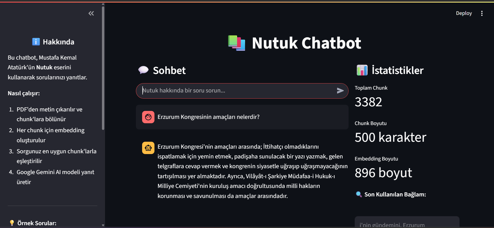

# 📚 Nutuk Chatbot

Bu proje, Mustafa Kemal Atatürk'ün **Nutuk** eserini kullanarak sorularınızı yanıtlayan yapay zeka destekli bir chatbot uygulamasıdır.

## 🎬 Örnek Kullanım



**Chatbot'un nasıl çalıştığını görmek için yukarıdaki ekran görüntüsüne bakabilirsiniz.**

## 🚀 Özellikler

- **PDF İşleme**: Nutuk PDF'ini otomatik olarak okur ve işler
- **Akıllı Arama**: Semantic search ile en uygun metin parçalarını bulur
- **AI Destekli Yanıtlar**: Google Gemini AI ile doğal dil yanıtları
- **Tarih Çıkarma**: Tarih sorularında otomatik tarih bilgisi çıkarımı
- **Web Arayüzü**: Streamlit ile modern ve kullanıcı dostu arayüz
- **Cache Sistemi**: Hızlı yanıt için akıllı önbellekleme


## 🏗️ Proje Yapısı

```
mintyfi_git_python_practice/
├── 📁 app.py                 # Ana Streamlit web uygulaması
├── 📁 chatbot.py             # Core chatbot mantığı ve AI fonksiyonları
├── 📁 requirements.txt       # Python paket bağımlılıkları
├── 📁 README.md             # Bu dosya
├── 📁 .gitignore            # Git ignore kuralları
├── 📁 data/
│   └── 📄 nutuk.pdf         # Nutuk PDF dosyası (2.4MB)
├── 📁 cache/                # Önbellek dosyaları
│   ├── 📄 nutuk_chunks.pkl  # Metin parçaları (1.8MB)
│   └── 📄 nutuk_embeddings.pkl # Embedding vektörleri (12MB)
└── 📁 __pycache__/          # Python cache dosyaları
```


## 📥 Kurulum & Çalıştırma

### **1. GitHub'dan Clone**
```bash
# Projeyi bilgisayarınıza indirin
git clone https://github.com/your-username/mintyfi_git_python_practice.git

# Proje dizinine girin
cd mintyfi_git_python_practice
```

### **2. ZIP Olarak İndirme**
1. GitHub'da proje sayfasına gidin
2. Yeşil "Code" butonuna tıklayın
3. "Download ZIP" seçeneğini seçin
4. ZIP dosyasını bilgisayarınıza indirin
5. ZIP dosyasını açın ve istediğiniz yere çıkarın

## 📋 Kurulum

### **1. Gereksinimler**
- **Python 3.8 veya üzeri** - [Python'u buradan indirin](https://www.python.org/downloads/)
- **pip paket yöneticisi** - Python ile birlikte gelir
- **Google Gemini API anahtarı** - [Google AI Studio'dan alın](https://makersuite.google.com/app/apikey)

### **2. Python Kurulumu Kontrolü**
```bash
# Python sürümünü kontrol edin
python --version

# pip sürümünü kontrol edin
pip --version
```

### **3. Paket Kurulumu**
```bash
# Gerekli paketleri otomatik olarak kurun
pip install -r requirements.txt
```

### **4. Environment Setup**
```bash
# .env dosyası oluşturun
echo "GEMINI_API_KEY=your_api_key_here" > .env
```

**Windows için:**
```cmd
# .env dosyası oluşturun
echo GEMINI_API_KEY=your_api_key_here > .env
```

**Not:** `your_api_key_here` yerine gerçek Gemini API anahtarınızı yazın!

## 🚀 Kullanım

### **Web Uygulaması (Önerilen)**
```bash
# Streamlit uygulamasını başlatın
streamlit run app.py
```

Uygulama otomatik olarak tarayıcınızda açılacaktır (genellikle http://localhost:8501)

### **Terminal Uygulaması**
```bash
# Doğrudan chatbot'u çalıştırın
python chatbot.py
```

## 💡 Örnek Sorular

### **Tarih Soruları**
- "Atatürk Samsun'a ne zaman çıkmıştır?"
- "TBMM ne zaman kuruldu?"
- "İzmir'in kurtuluşu ne zaman oldu?"

### **Genel Sorular**
- "Kurtuluş Savaşı nasıl başladı?"
- "Milli Mücadele döneminde yaşanan zorluklar nelerdir?"

## 🔧 Konfigürasyon

### **Cache Ayarları**
- **Chunk Boyutu**: 500 karakter
- **Overlap**: 50 karakter
- **Cache Dizini**: `./cache/`

### **AI Model Ayarları**
- **Embedding Model**: `HIT-TMG/KaLM-embedding-multilingual-mini-instruct-v1.5`
- **Gemini Model**: `gemini-1.5-flash`
- **Temperature**: 0.7
- **Top-p**: 0.9
- **Top-k**: 50

## 📊 Performans

- **PDF İşleme**: ~2.4MB Nutuk dosyası
- **Chunk Sayısı**: Otomatik hesaplanır
- **Embedding Boyutu**: Model tarafından belirlenir
- **Yanıt Süresi**: <5 saniye (cache ile)

