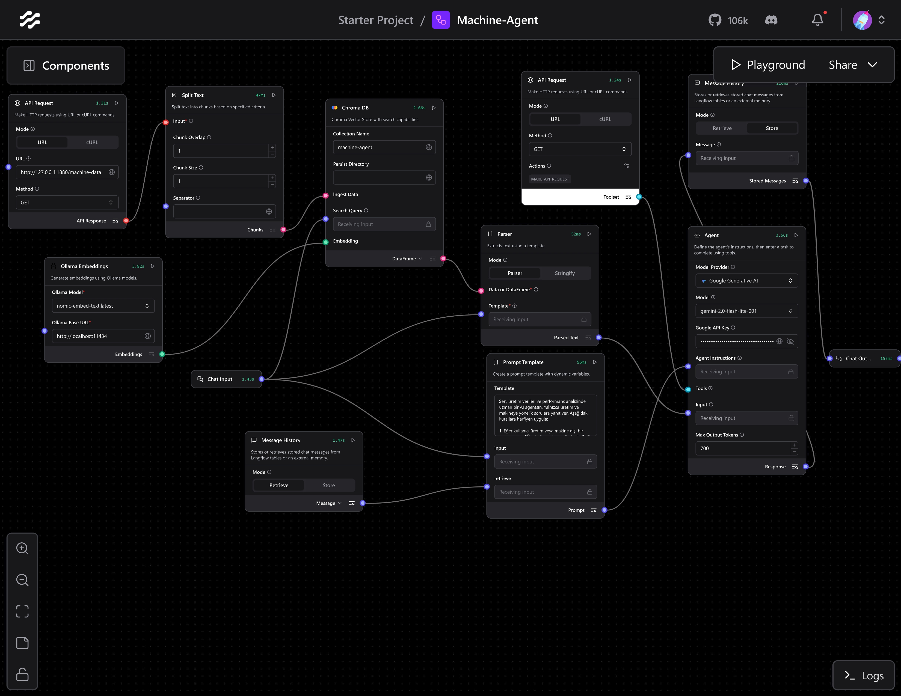
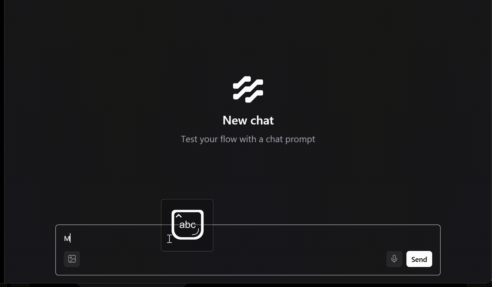

# 🏭 Machine-Agent Projesi

Bu proje, makine verilerinin REST API üzerinden yayınlanması ve Langflow kullanılarak geliştirilen bir agent tarafından analiz edilmesi için hazırlanmıştır. Amaç, üretim hattına ait verileri işleyip kullanıcı sorularına cevap verebilen, ancak yalnızca üretim odaklı çalışan bir yapay zeka agent geliştirmektir.

## Proje Bileşenleri

### 1. Node-RED (Makine Veri Yayını)

Makine verileri REST API üzerinden servis edilmektedir.

**Flow Yapısı:**
```
http in → function → http response
```

**Function Node JavaScript Kodu:**

```javascript
// Fonksiyon: o anki zamanı GG-AA-YYYY HH:MM:SS formatında döndür
function simdikiZaman() {
    let now = new Date();
    let gun = String(now.getDate()).padStart(2,'0');
    let ay = String(now.getMonth()+1).padStart(2,'0');
    let yil = now.getFullYear();
    let saat = String(now.getHours()).padStart(2,'0');
    let dakika = String(now.getMinutes()).padStart(2,'0');
    let saniye = String(now.getSeconds()).padStart(2,'0');

    return `${gun}-${ay}-${yil}  ${saat}:${dakika}:${saniye}`;
}

// 1 makine için temel değerler
let makineler = [
    {makine_id: 1, sicaklik: 98, titresim: 0.5, hiz: 1200, verim: 88},
];

// Rastgelelik fonksiyonu
function rastgeleDegisiklik(deger, sapma) {
    return +(deger + (Math.random() * 2*sapma - sapma)).toFixed(2);
}

// Veri üret
let veriSeti = makineler.map(makine => {
    return {
        makine_id: makine.makine_id,
        zaman: simdikiZaman(),
        sicaklik: rastgeleDegisiklik(makine.sicaklik, 1),
        titresim: rastgeleDegisiklik(makine.titresim, 0.05),
        hiz: Math.round(rastgeleDegisiklik(makine.hiz, 5)),
        verim: Math.round(rastgeleDegisiklik(makine.verim, 1))
    };
});

msg.payload = veriSeti[0];
return msg;
```

**API Endpoint:**
```
GET http://127.0.0.1:1880/machine-data
```

**Örnek Çıktı:**
```json
{
  "makine_id": 1,
  "zaman": "29-08-2025 20:30:15",
  "sicaklik": 97.5,
  "titresim": 0.48,
  "hiz": 1197,
  "verim": 89
}
```

### 2. Langflow (Makine Agent)

Langflow üzerinde bir agent tasarlanmıştır.

**Kullanılan Modeller:**
- **Model:** `gemini-2.0-flash-lite` (Google Generative AI)
- **Embedding:** `nomic-embed-text` (Ollama üzerinden)

**Agent Özellikleri:**
- Yalnızca üretim verileri ile ilgili sorulara cevap verir
- Üretim dışı sorulara yanıt vermez
- Makine verisi gerekmeyen sorularda REST API isteği atmaz
- Sohbet geçmişini hatırlayabilir

**Langflow Akış Yapısı:**



## Çalışma Mantığı

1. **Node-RED** üzerinden makine verisi REST API olarak yayınlanır
2. **Langflow** içerisindeki agent, ihtiyaç duyduğunda API'den veri çeker
3. **Agent**, yalnızca üretim odaklı soruları yanıtlar
4. **Sohbet geçmişi** saklanır ve analizlerde kullanılabilir

## Gereksinimler

### Yazılım Gereksinimleri
- **Node-RED** - Makine veri yayını için
- **Langflow** - Agent geliştirme platformu
- **Python 3.10+** - Langflow çalışması için

### API Gereksinimleri
- **Google Generative AI (Gemini)** API Key
- **Ollama** - Embedding için nomic-embed-text modeli

## Kurulum ve Çalıştırma

### 1. Node-RED Kurulumu
```bash
# Node-RED'i global olarak kur
npm install -g node-red

# Node-RED'i başlat
node-red
```

### 2. Langflow Kurulumu
```bash
# Langflow'u pip ile kur
pip install langflow

# Langflow'u başlat
langflow
```

### 3. Ollama Kurulumu
```bash
# Ollama'yı kur (https://ollama.ai)
# nomic-embed-text modelini indir
ollama pull nomic-embed-text
```

### 4. Proje Yapılandırması

#### Node-RED Flow Kurulumu
1. Node-RED arayüzünü aç (`http://localhost:1880`)
2. Aşağıdaki node'ları ekle:
   - `http in` node (GET `/machine-data`)
   - `function` node (yukarıdaki JavaScript kodu ile)
   - `http response` node
3. Node'ları bağla ve deploy et

#### Langflow Agent Kurulumu
1. Langflow arayüzünü aç (`http://localhost:7860`)
2. Machine-Agent projesini aç
3. Embedding kısmında Ollama `nomic-embed-text` seç
4. Model kısmında Gemini `gemini-2.0-flash-lite` seç

## Test Etme

### API Testi
```bash
# Makine verisi API'sini test et
curl http://127.0.0.1:1880/machine-data
```

### Agent Testi
1. Langflow playground'unda agent ile sohbet başlat
2. Üretim verileri hakkında sorular sor
3. Agent'ın sadece üretim odaklı yanıt verdiğini doğrula


## Örnek Kullanım Senaryoları

Örnek bir kullanım aşapısı aşağıda verilmiştir:



### Desteklenen Sorular
- "Makine 1'in sıcaklığı nedir?"
- "Hangi makine en yüksek verimle çalışıyor?"
- "Titreşim değerleri normal mi?"
- "Makine performansı nasıl?"

### Desteklenmeyen Sorular
- "Hava durumu nasıl?"
- "Matematik problemi çöz"
- "Genel sohbet yapalım"


## Ek Kaynaklar

- [Node-RED Dokümantasyonu](https://nodered.org/docs/)
- [Langflow Dokümantasyonu](https://docs.langflow.org/)
- [Google Generative AI](https://ai.google.dev/)
- [Ollama](https://ollama.ai/)

