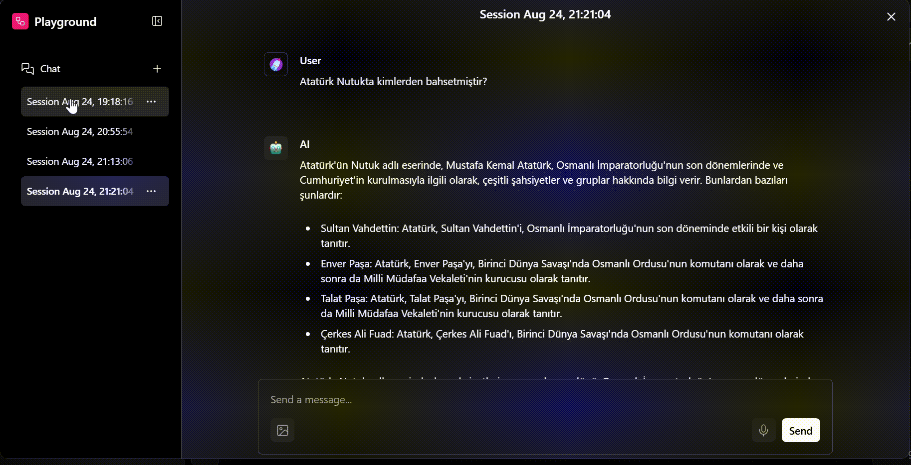

# Nutuk Chatbot (No-Code RAG Yaklaşımı ile)

Bu proje, **LangFlow** kullanılarak **kod yazmadan** geliştirilmiş bir Nutuk chatbot uygulamasıdır. Chatbot, Mustafa Kemal Atatürk'ün Nutuk eserini baz alarak kullanıcıların sorularını yanıtlamak için **Retrieval-Augmented Generation (RAG)** mantığını kullanır.

## 🎯 Proje Amacı

**No-code yaklaşımı** ile LangFlow'un görsel arayüzünü kullanarak, Nutuk eserindeki bilgileri kullanarak kullanıcıların sorularını doğru ve bağlama uygun şekilde yanıtlamak.

## ✨ Özellikler

- **🚀 No-Code Geliştirme**: Kod yazmadan LangFlow'un görsel arayüzü ile geliştirildi
- **🔗 RAG Mantığı**: Dokümanlardan alınan bilgilerle yanıt üretir
- **📊 Embedding**: ollama embeddings ile metinleri vektörlere dönüştürür (nomic-embed-text)
- **🤖 Language Model**: ollama/llama3:latest kullanılır
- **💬 Message History**: Konuşma geçmişi saklanır ve yanıt üretiminde dikkate alınır
- **🗄️ Veritabanı**: ChromaDB ile dokümanlar ve embeddingler saklanır

## 🚀 Kurulum

### Gereksinimler

- Python 3.8+
- Ollama (yerel kurulum gerekli)

> **💡 No-Code Avantajı**: Bu proje tamamen LangFlow'un görsel arayüzü kullanılarak geliştirilmiştir. Kod yazma bilgisi gerektirmez!

### 1. Python Ortamını Hazırla

```bash
# Gerekli paketleri yükle
pip install langflow
pip install chromadb
pip install ollama
```

### 2. Ollama'yı Kur ve Başlat

```bash
# Ollama'yı indir ve kur (https://ollama.ai)
# Gerekli modelleri yükle
ollama pull llama3:latest
ollama pull nomic-embed-text:latest
```

### 3. LangFlow'u Başlat

```bash
langflow
```

LangFlow arayüzü `http://localhost:3000` adresinde açılacaktır.

> **🎬 Görsel Rehber**: Kurulum tamamlandıktan sonra yukarıdaki demo görüntülerini inceleyerek LangFlow akış yapısını ve chatbot'un nasıl çalıştığını görebilirsiniz!

### Model Parametreleri

| Parametre | Değer |
|-----------|-------|
| **Chunk Size** | 1000 |
| **Chunk Overlap** | 200 |
| **LLM Top K** | 50 |
| **LLM Top P** | 0.9 |
| **LLM Temperature** | 0.7 |
| **Embedding Model** | nomic-embed-text:latest |
| **Language Model** | ollama/llama3:latest |
| **Database** | ChromaDB |

## 📖 Kullanım

### 1. Chatbot'u Başlat

> **🖱️ Sürükle & Bırak**: LangFlow'un görsel arayüzünden chatbot akışını yükle veya sürükle-bırak ile oluşturun!

LangFlow arayüzünden chatbot akışını yükle veya oluşturun.

### 🎬 Demo Görüntüleri

#### LangFlow Akış Yapısı


*LangFlow'taki node'lar ve bağlantılar - No-code RAG chatbot yapısı*

#### Chatbot Yanıt Demo


*Chatbot'un Nutuk hakkında sorulara nasıl yanıt verdiğini gösteren demo*

### 2. Soru Sor

Chatbot arayüzünden Nutuk ile ilgili sorularınızı sorabilirsiniz:

- "Kurtuluş Savaşı ne zaman başladı?"
- "Atatürk'ün Samsun'a çıkışı hakkında bilgi verir misin?"
- "Cumhuriyet nasıl ilan edildi?"

### 3. RAG Süreci

1. **Soru Embedding**: Kullanıcı sorusu embedding modeli ile vektöre dönüştürülür
2. **Doküman Arama**: ChromaDB'de benzer chunk'lar aranır
3. **Yanıt Üretimi**: Bulunan chunk'lar LLM'e verilerek yanıt oluşturulur
4. **Bağlam Kontrolü**: Mesaj geçmişi kullanılarak yanıt bağlama uygun hale getirilir

## ⚠️ Önemli Notlar

- **Mesaj Geçmişi**: Message History henüz tam stabil olmayabilir; LangFlow arayüzünde Memory node'u doğru konumlandırmak önemlidir
- **RAG Sınırları**: RAG mantığıyla çalıştığı için yanıtlar Nutuk içeriğiyle sınırlıdır
- **Model Performansı**: Ollama modellerinin performansı sistem kaynaklarına bağlıdır


### Proje Yapısı

```
mintyfi_git_python_practice/
├── README.md
├── chatbot.json          # LangFlow akış konfigürasyonu (JSON export)
├── langflow_gif.gif     # LangFlow akış yapısı demo görüntüsü
└── chatbot_gif.gif      # Chatbot yanıt demo görüntüsü
```


- [LangFlow Dokümantasyonu](https://docs.langflow.org/)
- [Ollama Dokümantasyonu](https://ollama.ai/docs)
- [ChromaDB Dokümantasyonu](https://docs.trychroma.com/)
- [Nutuk Eseri]

