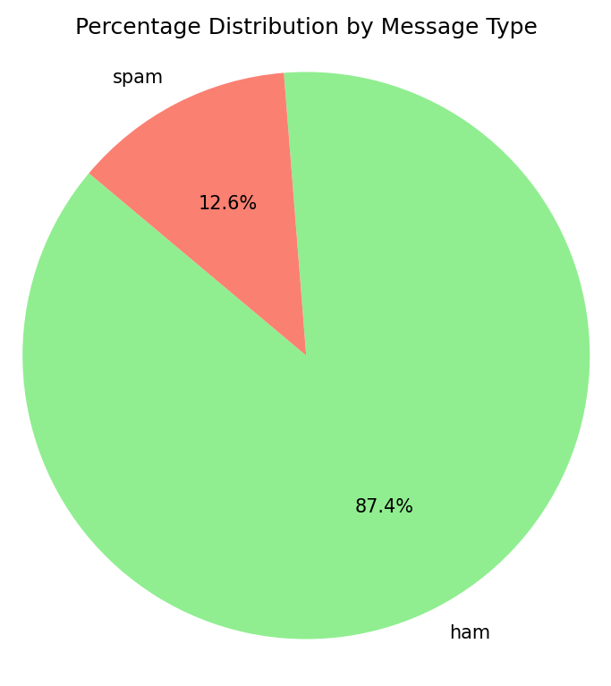

dataset.py ' yi çalıştırdığımda çıktı aşağıdaki gibi olmaktadır.
```
RangeIndex: 5572 entries, 0 to 5571
Data columns (total 2 columns):
 #   Column   Non-Null Count  Dtype 
---  ------   --------------  ----- 
 0   label    5572 non-null   object
 1   message  5572 non-null   object
dtypes: object(2)
memory usage: 87.2+ KB

Number of missing values per column:
label      0
message    0
dtype: int64

Number of duplicate records: 403
Record count after removing duplicates: 5169

label
ham     4516
spam     653
Name: count, dtype: int64
```

Veri seti 5572 SMS mesajından oluşmaktadır ve iki sütun içerir: `label` ve `message`.

Eksik değer kontrolü yaptığımda, `label` ve `message` sütunlarında eksik kayıt bulunmadı.

Veri setiyle ilgili genel istatistikler:

- Toplam kayıt sayısı: **5572**
- Eksik değer bulunan kayıt sayısı: **0**
- Tamamen aynı (duplicate) kayıt sayısı: **403**
- Duplicate kayıtlar temizlendikten sonraki kayıt sayısı: **5169**

Sınıf dağılımı şu şekildedir:

- `ham` mesaj sayısı: **4516**
- `spam` mesaj sayısı: **653**

Temizlenmiş veri `sms_clean.csv` dosyasına kaydedilmiştir.

Aşağıda mesaj sınıflarının sayısal dağılımını gösteren grafik yer almaktadır:



