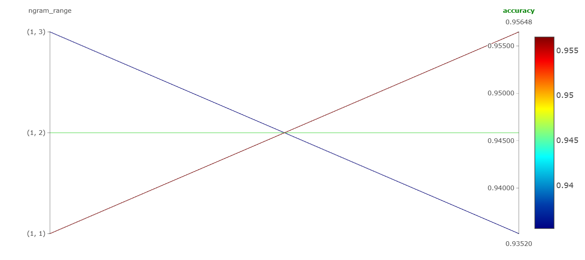
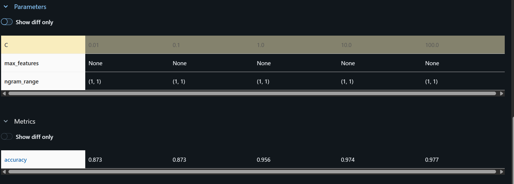
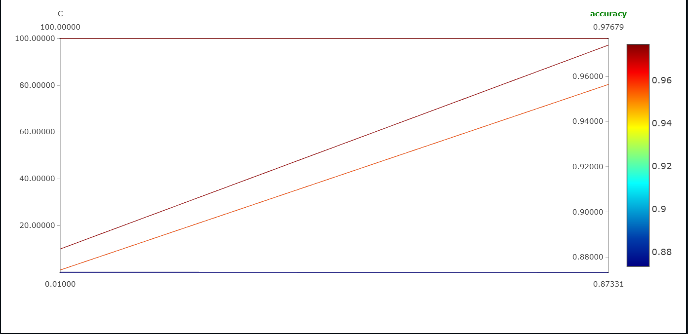
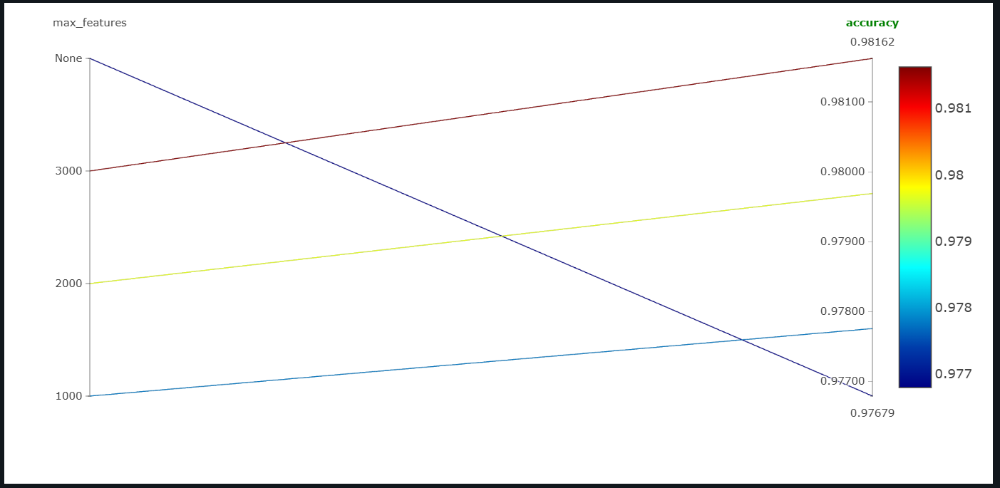
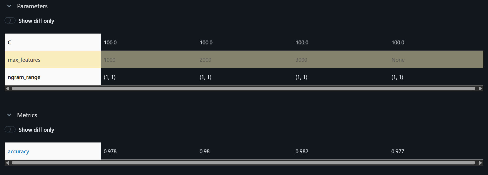

### En İyi Koşu:
- Accuracy: 0.98162475822050
- ngram_range: (1,1)
- C: 100.0
- max_features: 3000

### Model Artefact Linki:
[Model Artefacti](http://localhost:5000/#/experiments/0/models/m-edf41ba075fb4d079953d28d45815cda/artifacts)

Öncelikle C ve max_feature parametlerini sabit tutarak 3 farklı ngram_range parametresi ile koştum.

En yüksek accuracy değerini veren ngram_range = (1,1) ' di.

Sonrasında En yüksek accuracy değerini veren ngram_range değeri ile devam ettim. Bu sefer ngram_range ve max_feature parametrelerini sabit tutarak 5 farklı C parametresi ile koştum.

En yüksek accuracy değerini veren C = 100.0 ' di.

Sonrasında En yüksek accuracy değerini veren C değeri ile devam ettim. Bu sefer ngram_range ve C parametrelerini sabit tutarak 4 farklı max_feature parametresi ile koştum.

En yüksek accuracy değerini veren max_feature = 3000 ' di.

Böylelikle en yüksek accuracy değerini veren koşu :

- Accuracy: 0.9816247582205
- ngram_range: (1,1)
- C: 100.0  
- max_features: 3000
oldu.