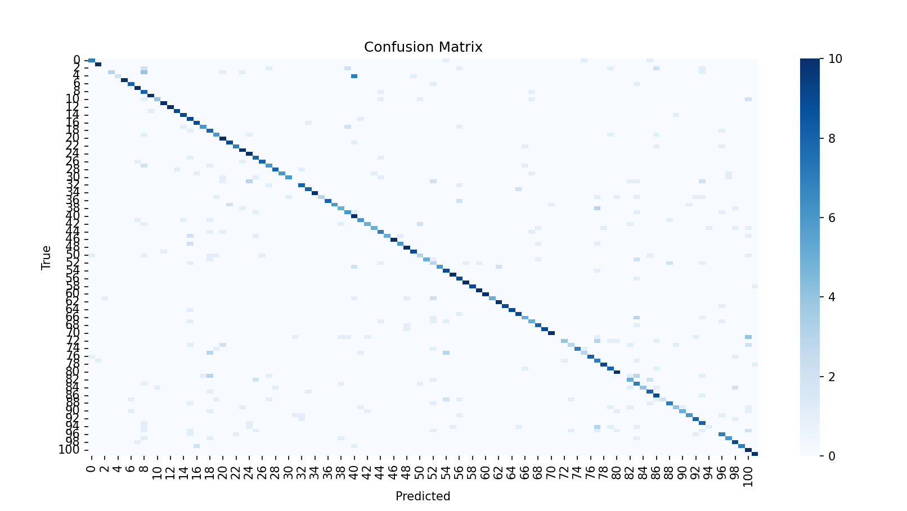
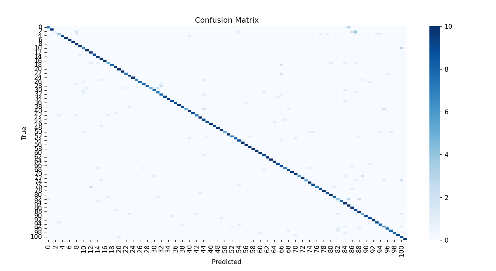

## Model Bilgileri
- **Model:** ResNet18 (ImageNet üzerinde önceden eğitilmiş)
- **Veri seti:** Flowers102 (102 sınıflık çiçek verisi)
- **Çıkış katmanı:** Fully connected (fc) katmanı 102 sınıfa göre yeniden düzenlendi
- **Giriş boyutu:** [1, 3, 224, 224]
- **Embedding (fc katmanı öncesi) boyutu:** [1, 512]
- **Model çıktı (logits) boyutu:** [1, 102]

- Model ilk aşamada sadece **son katman (fc)** eğitildi; feature extractor katmanları donduruldu. 

- Daha sonra tüm katmanlar açılarak model **fine-tuning** yöntemiyle baştan sona eğitildi.  

- Böylece transfer learning, hem “feature extraction” hem de “fine-tuning” aşamalarını içerdi.

Model test veri seti üzerinde sınıflandırma metrikleriyle değerlendirildi.  
Yaklaşık **%85 doğruluk** elde edildi.
Bazı sınıflar mükemmel sonuç verirken (F1 = 1.00), birkaç sınıfta düşük başarı gözlemlendi (örneğin sınıf 2 ve 83 gibi).  
Bu durum, veri dengesizliğinden kaynaklanıyor olabilir.

**Detaylı sınıflandırma raporu için:** `classification_report.txt` dosyasına bakabilirsiniz.

- Transfer learning genel olarak başarılı oldu.  
- 512 boyutlu embedding vektörü, görsellerin yüksek seviyeli temsillerini çıkarmakta.  